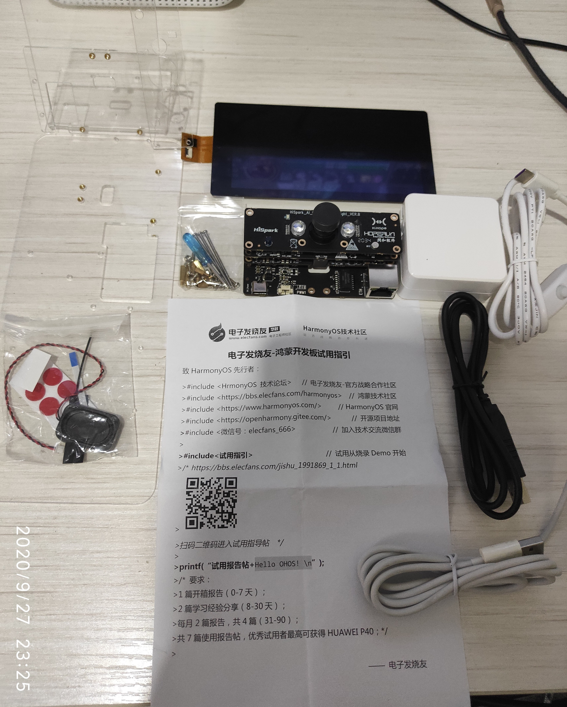

# [HarmonyOS HiSpark AI Camera使用连载]—0.开箱

[TOC]

## 0、引言

* HarmonyOS是一款“面向未来”、面向全场景（移动办公、运动健康、社交通信、媒体娱乐等）的分布式操作系统。在传统的单设备系统能力的基础上，提出了基于同一套系统能力、适配多种终端形态的分布式理念，能够支持多种终端设备。

#### HarmonyOS四大技术特性

* 1.分布式架构首次用于终端OS，实现跨终端无缝协同体验

* 2.确定时延引擎和高性能IPC技术实现系统天生流畅

* 3.基于微内核架构重塑中断设备可信安全

* 4.通过统一IDE支撑一次开发，多端部署，实现跨终端生态共享

## 1、开箱 

### 1.1、套件开箱
 
首先拿到的是一整套塑料盒包装好的开发套件，非常简洁规整，封面大大的“AI Camera开发套件”映入眼帘

### 1.2、开发套件全家福正面照
拆开塑料包装盒之后，得到开发板套件的全家福，可见配件齐全，螺丝、支架应有尽有：

### 1.3、开发套件组装
将上面的所有配件按照提供的[组装视频](https://www.bilibili.com/video/BV1tV411m7gW) 进行组装，成功后得到如下所示的带屏加开发套件：

### 1.4、开发套件上电
将组装成功的开发套件在背面TypeC接口上电后，如下图所示：

即进入开机的Demo程序，PS:这里未得摄像头盖子打开：

## 2、Hi3516开发板介绍

## 2.1开发板简介

Hi3516DV300作为新一代行业专用Smart HD IP摄像机SOC，集成新一代ISP、业界最新的H.265视频压缩编码器，同时集成高性能NNIE引擎，使得Hi3516DV300在低码率、高画质、智能处理和分析、低功耗等方面引领行业水平。

## 开发板规格

<table><thead align="left"><tr id="row10171198194310"><th class="cellrowborder" valign="top" width="14.77%" id="mcps1.2.3.1.1">
规格类型

</th>
<th class="cellrowborder" valign="top" width="85.22999999999999%" id="mcps1.2.3.1.2">
规格清单

</th>
</tr>
</thead>
<tbody><tr id="row0171168114311"><td class="cellrowborder" valign="top" width="14.77%" headers="mcps1.2.3.1.1 ">
<strong id="b127621861200">处理器及内部存储</strong>

</td>
<td class="cellrowborder" valign="top" width="85.22999999999999%" headers="mcps1.2.3.1.2 "><ul id="ul1147113537186"><li>Hi3516DV300芯片</li><li>DDR3 1GB</li><li>eMMC4.5，8GB容量</li></ul>
</td>
</tr>
<tr id="row21721687435"><td class="cellrowborder" valign="top" width="14.77%" headers="mcps1.2.3.1.1 ">
<strong id="b1172016266246">外部器件</strong>

</td>
<td class="cellrowborder" valign="top" width="85.22999999999999%" headers="mcps1.2.3.1.2 "><ul id="ul179543016208"><li>以太网口</li><li>音频视频<ul id="ul5941311869"><li>1路语音输入</li><li>1路单声道(AC_L)输出，接3W功放(LM4871)</li><li>MicroHDMI（1路HDMI 1.4）</li></ul>
</li><li>摄像头<ul id="ul924263620"><li>传感器IMX335</li><li>镜头M12，焦距4mm，光圈1.8</li></ul>
</li><li>显示屏<ul id="ul101471711667"><li>LCD连接器（2.35寸）</li><li>LCD连接器（5.5寸）</li></ul>
</li><li>外部器件及接口<ul id="ul089255556"><li>SD卡接口</li><li>JTAG/I2S 接口</li><li>ADC接口</li><li>舵机接口</li><li>Grove连接器</li><li>USB2.0(Type C)</li><li>功能按键3个，2个用户自定义按键，1个升级按键</li><li>LED指示灯，绿灯，红灯</li></ul>
</li></ul>
</td>
</tr>
</tbody>
</table>

## 3、硬件规格

Hi3516DV500是专为行业专用的智能高清IP摄像机设计的新一代SoC。它引入了新一代ISP，最新的H.265视频压缩编码器和高性能NNIE引擎。它在低比特率，高图像质量，智能处理和分析以及低功耗方面的优势可以超过客户的要求。

### 3.1、主要特点

#### 处理器内核
* 双核 ARM Cortex-A7@900MHz,32 KB I-Cach
* 32KB D-Cache, 256KB L2 Cache
* 支持NEON加速,集成FPU处理单元

#### 视频编解码

* H. 264 BP/MP/HP
* H 265 Main profile
* 支持IP帧,支持 Smart P参考
* MJPEG/JPEG Baseline编码

#### 视频编码、解码处理性能

* H264/H265编解码最大宽度2688,最大分辨率2688x1944,仅支持解码自身编码码流
* H264H.265多码流实时编码(解码)能力:
	- 2688x1536@30ps编码+720x480@30fps编码
	+360x240@30fps编码
	- 2688x1944@20ips编码+720x480@20fps编码
	+360x240@20fps编码
	- 1920x1080@30fps编码+720x480@30fps编码
	+1920x1080@30fps解码
* JPEG编码、解码能力:
	16M(4608x3456)@l0fps
* 支持 CBR/VBR/ FIXQP/AVBR/QPMAP五种码率控制模式
* 输出码率最高50Mbps
* 支持8个感兴趣区域(ROI)编码

#### 智能视频分析
* 集成神经网络加速引擎,处理性能达1.0Tops
* 集成智能计算加速引擎(含跟踪、人脸校正)

### 3.2、Hi3516DV30 规格信息：

* 神经网络加速引擎
Hi3516DV300配备了1T CNN神经网络加速引擎。这是提高在视频监控市场中支持AI应用的能力的关键，例如智能运动检测，面部识别等。

* KCF和面部标准化模块
Hi3516DV300支持KCF和人脸归一化模块，可以最大程度地提高物体跟踪的精度和人脸应用的可用性。

* 先进的WDR技术和8K-NR技术
与海思上一代产品相比，Hi3516DV300采用Advanced-WDR技术和8D-NR技术，可有效提高视频质量。
 
* 安全启动和硬件隔离系统
Hi3516DV300的系统配有安全启动和硬件隔离系统，可保护客户的产品和相机中的敏感数据。

* 解码器模块和本地显示接口
Hi3516DV300支持解码器模块和本地显示接口，因此也非常适用于考勤和门禁产品。

### 3.3、Hi3516DV30 框架图：

## 4、总结&参考资料

[入门指南](https://gitee.com/openharmony/docs/blob/master/quick-start/Hi3516开发板.md) 

[鸿蒙OS指南](https://gitee.com/openharmony/docs/tree/master/readme)

[源码获取](https://openharmony.gitee.com/openharmony/docs/blob/master/get-code/源码获取.md)
