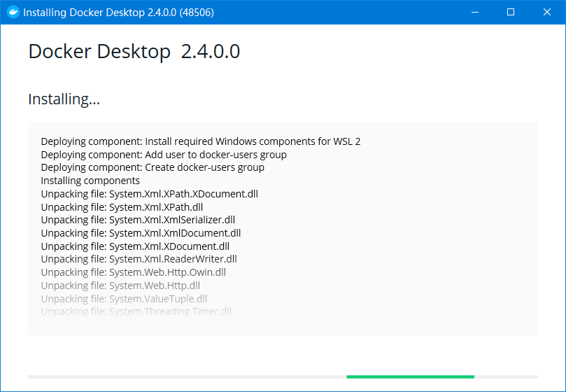
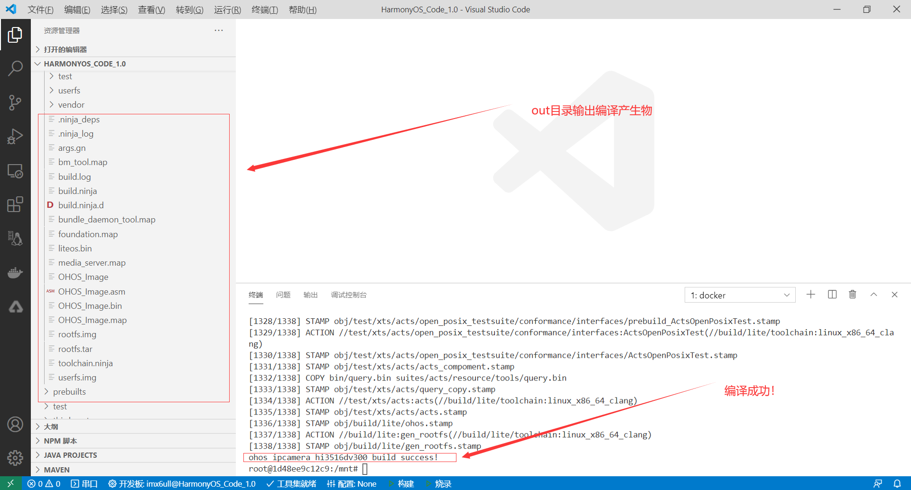

# HarmonyOS开发板使用连载—1.纯WIN10下开发环境搭建
[TOC]

## 0、引言
### 本文将实现 `win10版本docker`+`HarmonyOS代码编译环境`+`VSCode`+ `HUAWEI DevEco Device Tool` 在Windows10下面实现的集代码开发、编译、烧写、调试等一站化的IDE工具

* 主机：Windows10


* VS Code版本

```
Version: 1.50.1 (user setup)
Commit: d2e414d9e4239a252d1ab117bd7067f125afd80a
Date: 2020-10-13T15:06:15.712Z
Electron: 9.2.1
Chrome: 83.0.4103.122
Node.js: 12.14.1
V8: 8.3.110.13-electron.0
OS: Windows_NT x64 10.0.19041
```

* DevEco Device Tool 版本

```
devicetool-device-1.0.0.1
```

* docker 版本(docker Desktop for win10)

```
Docker version 19.03.13, build 4484c46d9d
```


# 1、为什么选择这种搭配
原因有三：

* 免搭建Linux环境下的各种包or各种依赖...，小白上手，有手就行！
* 脱离Linux环境下各种文件网络共享，直接操作本地源码、文件，效率高！
* 集代码开发、编译、烧写、调试于一体，告别各种不友好，摇身一变51单片机


# 2、安装环境

### 2.1、安装WIN10版Docker
docker Desktop 下载地址：https://desktop.docker.com/win/stable/Docker%20Desktop%20Installer.exe



安装完成后，点击重启即可：


### 2.2、配置docker加速

在桌面右下角状态栏中右键 docker 图标，修改在 Docker Daemon 标签页中的 json ，把下面的地址:

```
http://f1361db2.m.daocloud.io
```

加到" registry-mirrors"的数组里,如下两图所示：


最后点击“Apply&Restart”

### 2.3、测试docker

运行WIN10的CMD 或者 powershell 窗口，输入命令：
    
    docker run -d -p 80:80 docker/getting-started

即可成功拉取docker镜像：


拉取成功后，输入`docker images`命令即可看到：多一个`docker/getting-started`的镜像，如下图所示：


### 2.4、下载鸿蒙OS集成开发docker环境

运行WIN10的CMD 或者 powershell 窗口，输入命令：
    

    docker pull jackeyt/ohms_buildenv:hi351x

即可成功拉取docker镜像：


### 2.5、下载鸿蒙OS集成开发docker环境

运行WIN10的CMD 或者 powershell 窗口，输入命令：
    

    docker pull jackeyt/ohms_buildenv:hi351x

即可成功拉取docker镜像：


### 2.6、安装VSCode及插件

#### 2.6.1 安装VSCode

* 选择Windows版本即可，下载地址：https://code.visualstudio.com

#### 2.6.2 安装VSCode插件

> 点击VSCode侧边栏->插件->输入插件名称->安装

1. docker
2. Remote Development
3. C/C++
4. C/C++ Snippets
5. python
6. GN


> 安装VSCode插件：HUAWEI DevEco Device Tool
> 下载可能需要华为帐号

[下载地址](https://device.harmonyos.com/cn/ide#download)

安装过程如下图所示：


# 3、编译HarmonyOS

### 3.1、下载源码

下载源码的方式，官方介绍了四种，这里以最常用的为例：

点击[下载链接](https://repo.huaweicloud.com/harmonyos/os/1.0/code-1.0.tar.gz)
下载得到一个`code-1.0.tar.gz`源码压缩包，并解压到一个目录，这里以'J:\HarmonyOS_Code_1.0'为例。

### 3.2、使用VSCode IDE打开源码

按上文描述，得到一个集成各种开发环境的VSCode之后，使用VSCode打开源码所在目录文件夹，这里以'J:\HarmonyOS_Code_1.0'为例：


### 3.3、使用VSCode IDE运行HarmonyOS编译环境

在IDE下，使用快捷键'Ctrl+`'快速打开终端，输入如下命令，快速启动前文下好的Docker环境：

`
docker run -it --rm  -v J:/HarmonyOS_Code_1.0:/mnt jackeyt/ohms_buildenv:hi351x bash
`

* 说明:-v 为docker共享文件参数，使用该参数，将`J:/HarmonyOS_Code_1.0`的源码共享到Docker中的`/mnt`文件夹中了

* 效果如下图所示：


有了编译环境，现在我们离编译成功就差两个命令了：

* 切换到源码目录：`cd /mnt`
* 执行编译:`python build.py ipcamera_hi3516dv300 -b debug`


* 编译成功后，得到如下所示结果：




# 4、烧录HarmonyOS


开发鸿蒙有两种方式可以用于烧写系统、uboot、文件系统，分别是使用海思提供的Vscode插件HUAWEI DevEco Device Tool和使用Hitool进行烧录，两者均支持串口、网口、USB等三种方式进行烧录。

## 4.1、使用HUAWEI DevEco Device Tool进行烧录

华为提供的工具：HUAWEI DevEco Device Tool 提供了烧录的全环境，可以参考官方的使用链接：

`
https://device.harmonyos.com/cn/docs/ide/user-guides/service_introduction-0000001050166905
`


根据文档指示完成VSCode插件安装，及JDK安装：
DevEco Device Tool以插件方式提供，基于Visual Studio Code进行扩展，安装分为如下：

1. 安装Node.js
1. 安装hpm


## 4.2、使用Hitool进行烧录

本文已经串口及网口烧录进行说明

* Hitool下载地址如下：

`
链接：https://pan.baidu.com/s/1Hq_rsATDLNMEQuH_rUNP_Q 
提取码：rsej
` 

### 4.2.1 使用Hitool进行烧录之串口

打开`HiTool.exe`进入主界面，选择芯片，这里以`hi3516dv300`为例，选择`HiBurn`工具：


* 按下图操作，打开分区xml文件


* xml文件可按本文提供的模板进行使用，复制以下代码，并保存为.xml文件


```
<?xml version="1.0" encoding="GB2312" ?>

<Partition_Info>

<Part Sel="1" PartitionName="fastboot" FlashType="emmc" FileSystem="none" Start="0" Length="1M" 

SelectFile=""/>

<Part Sel="1" PartitionName="kernel" FlashType="emmc" FileSystem="none" Start="1M" Length="9M" SelectFile=""/>

<Part Sel="1" PartitionName="rootfs" FlashType="emmc" FileSystem="none" Start="10M" Length="15M" SelectFile=""/>

<Part Sel="1" PartitionName="userfs" FlashType="emmc" FileSystem="none" Start="25M" Length="50M" SelectFile=""/>

</Partition_Info>
```

如本文所例，保存为'Hi3516DV300_burn.xml'后，浏览打开：


可以看见，分区表已经导入，具体分区是参考官方文档提供的分区表：


* 加载需下载文件

按上面提供的分区表，我们需要下载的文件有四个，分别是`uboot.bin`、`OHOS_Image.bin`、`rootfs.img`、`userfs.img`,按下图操作，一个个文件导入：


* 最终，导入的效果如下图所示：


* 开始下载

点击界面上的"烧写"按键，进入烧录流程，并按提示进行重新上电：


* 烧录过程：


等待一个多小时才能烧录完成，因为串口的速度比较慢。


### 4.2.2 使用Hitool进行烧录之网口

* 配置Uboot IP地址：

```
setenv serverip  192.168.1.111
setenv ethaddr  00:11:22:33:44:55
setenv gatewayip 192.168.1.1
setenv netmask  255.255.255.0
setenv ipaddr 192.168.1.188
saveenv
```

配置成功之后，可以使用`ping 192.168.1.111`测试一下

* 使用Hitool进行烧录：

将烧录方式，IP地址等按照如下图所示，完成配置：


* 烧写过程如上文所示进行即可：


### 4.2.3 使用Hitool烧录完成，配置uboot


```
setenv bootcmd "mmc read 0x0 0x80000000 0x800 0x4800; go 0x80000000";
setenv bootargs "console=ttyAMA0,115200n8 root=emmc fstype=vfat rootaddr=10M rootsize=15M rw";
saveenv
reset
```


# 4、调试HarmonyOS

参考官方教程：https://device.harmonyos.com/cn/docs/ide/user-guides/arm_debug-0000001052809856
