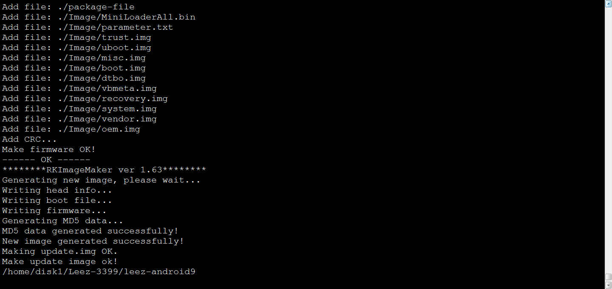

#  LeezPi-RK3399_Android9固件编译
[TOC]

## 准备工作
编译 Android 对机器的配置要求较高：

*   64 位 CPU
*   16GB 物理内存+交换内存
*   30GB 空闲的磁盘空间用于构建，源码树另外占用大约 25GB

官方推荐 Ubuntu 14.04 操作系统，经测试，Ubuntu 12.04 也可以编译运行成功，只需要满足[http://source.android.com/source/building.html](http://source.android.com/source/building.html)里的软硬件配置即可。编译环境的初始化可参考[http://source.android.com/source/initializing.html](http://source.android.com/source/initializing.html)。

*   安装 OpenJDK 8:

`sudo apt-get install openjdk-8-jdk`


提示：安装 openjdk-8-jdk，会更改 JDK 的默认链接，这时可用：

```
$ sudo update-alternatives --config java
$ sudo update-alternatives --config javac
```

来切换 JDK 版本。SDK 在找不到操作系统默认 JDK 的时候会使用内部设定的 JDK 路径，因此，为了让同一台机器可以编译 Android 5.1 及之前的版本，去掉链接更方便：


`$ sudo /var/lib/dpkg/info/openjdk-8-jdk:amd64.prerm remove`   


* Ubuntu 12.04 软件包安装：
```
sudo apt-get install git gnupg flex bison gperf build-essential \
zip curl libc6-dev libncurses5-dev:i386 x11proto-core-dev \
libx11-dev:i386 libreadline6-dev:i386 libgl1-mesa-glx:i386 \
g++-multilib mingw32 tofrodos gcc-multilib ia32-libs \
python-markdown libxml2-utils xsltproc zlib1g-dev:i386 \
lzop libssl1.0.0 libssl-dev
```


* Ubuntu 14.04 软件包安装：

```
sudo apt-get install git-core gnupg flex bison gperf libsdl1.2-dev \
libesd0-dev libwxgtk2.8-dev squashfs-tools build-essential zip curl \
libncurses5-dev zlib1g-dev pngcrush schedtool libxml2 libxml2-utils \
xsltproc lzop libc6-dev schedtool g++-multilib lib32z1-dev lib32ncurses5-dev \
lib32readline-gplv2-dev gcc-multilib libswitch-perl \
libssl1.0.0 libssl-dev   
```

*   Ubuntu 18.04 软件包安装：

```
sudo apt-get install libx11-dev:i386 libreadline6-dev:i386 libgl1-mesa-dev g++-multilib \
git flex bison gperf build-essential libncurses5-dev:i386 \
dpkg-dev libsdl1.2-dev libesd0-dev \
git-core gnupg flex bison gperf build-essential \
zip curl zlib1g-dev gcc-multilib g++-multilib \
libc6-dev-i386 lib32ncurses5-dev x11proto-core-dev libx11-dev \
libgl1-mesa-dev libxml2-utils xsltproc unzip m4 lib32z-dev ccache \
make make-guile  tofrodos python-markdown libxml2-utils xsltproc zlib1g-dev:i386
```

##  编译

* 设置环境
```
$ source build/envsetup.sh 
```

* 选择要编译的项目chestnut××××
```
$ lunch
```

* 使用脚本编译
	下面是编译参数的说明

```
./build_leez.sh
```

```
USAGE: [-S] [-U] [-K] [-A] [-p] [-o] [-u] [-v VERSION_NAME]  
No ARGS means use default build option                  
       -S = build image which boot from sd card               
       -U = build uboot                                 
       -K = build kernel                                
       -A = build android                               
       -p = will build packaging in IMAGE               
       -o = build OTA package                           
       -u = build update.img                            
       -v = build android with 'user' or 'userdebug'
```

* 如果是编译SD卡启动的Image，一定要带-S参数。例如：
编译 uboot、kernel、android，并打包为update.img
```
	./build_leez.sh -SUKAu
```
	
* 仅编译 kernel 和android 并打包为update.img
```
	./build_leez.sh -SKAu
```
	
* 如果是编译emmc启动的image，不用带-S 参数。其它用法同上述。

特别注意，sd卡启动和emmc启动，其kernel、recovery、fstab 都有区别。所以切换编译时，务必要重编 kernel 和 android, 就是说-KA 参数一定要有。
	
Note: android9.0因为SD卡和emmc兼容，所以不需要在编译时添加-S参数

##  编译过程


##  编译完成



##  编译生成固件
生成的固件在

```
./rockdev/Image-chestnut/update.img
```


