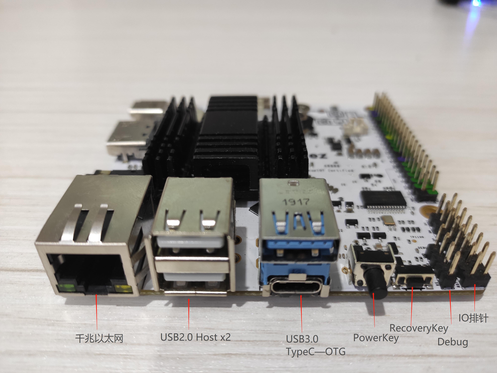

# LeezPi-RK3399_开箱
[TOC]

## 0、引言

> 栗子派LeezPi-RK3399，型号Leez P710，是联想Leez物联基于 RK3399 设计的一款高性能开发板，标配4GB LPDDR4内存, 板载2.4G & 5G双频WiFi模组, 带有标准完整的M.2 PCIe接口, 可直接安装使用4G模组。还带有MIPI-CSI双摄像头接口, MIPI-DSI和双显示接口, HDMI 2.0视频输出口，并具备Type-C/DP，USB 3.0, USB2.0，MicroSD, 千兆以太网口，3.5mm音频输出口，以及AD输入，调试串口，40Pin扩展口。

## 1、开箱 

* 带 Leez 标志性外盒

### 开发板正面照1

- 千兆以太网接口（向下兼容100、10Mbps）
- USB2.0 Hostx2
- 复合型USB3.0接口，上方为Host，下方为typec接口，用于OTG功能
- PowerKey，用于控制系统电源，安卓系统下的“开关机键”
- RecoveryKey，在uboot下用于控制系统进入Recovery模式进行刷机
- Debug排针，2.54MM，用于连接串口查看Debug信息
- IO排针

### 开发板正面照2

- 40Pin扩展口
- RTC电池接口
- 双MIPI接口，用于连接MIPI摄像头，上方可以连MIPI_DSI显示屏
- NanoSIM卡座
- TF卡座
- AP6535S模组：支持双频WIFI加蓝牙
- 电源灯、系统状态灯

### 开发板正面照3

- TypeC接口，用于板子供电
- HDMI2.0a视频输出
- 3.5MM耳机孔

### 开发板底板照

- 标准完整的M.2 PCIe接口，可接移远EM05模组
- EMMC芯片封装，内测版未贴，正式版会预置

## 2、硬件特性

* 主控芯片:Rockchip RK3399：big.LITTLE hexa-core processor with  2x Arm Cortex-A72 @ up to 1.8 GHz, 4x Cortex-A53 @ up to 1.4 GHz, a Mali-T864 GPU with support OpenGL ES1.1/2.0/3.0/3.1, OpenVG1.1, OpenCL, DX11, and AFBC, and a VPU with 4K VP9 and 4K 10-bit H265/H264 decoding

* GPU: Mali-T864 GPU，支持OpenGL ES1.1/2.0/3.0/3.1, OpenVG1.1, OpenCL, DX11, 支持AFBC（帧缓冲压缩）；

* VPU: 支持4K VP9 and 4K 10bits H265/H264 视频解码，高达60fps, 双VOP显示等视频编解码功能；

* 电源管理单元: RK808-D PMIC, 搭配独立DC/DC, 支持动态调压, 软件关机, 按键开机, RTC唤醒, 睡眠唤醒等功能；

* 内存: 双通道4GB LPDDR4；

* 有线网络: 原生千兆以太网；

* Wi-Fi/蓝牙: 802.11a/b/g/n/ac, Bluetooth 4.1 双频Wi-Fi蓝牙模块, 2x2 MIMO, 双天线；

* 视频: 1个或2个4线MIPI-CSI, 双ISP像素处理能力高达13MPix/s，支持双路摄像头数据同时输入；

> 视频输出：

* HDMI: HDMI 2.0a, 支持4K@60Hz显示，支持HDCP 1.4/2.2

* DP on Type-C: DisplayPort 1.2 Alt Mode on USB Type-C

* Audio Out: 3.5mm 双通道耳机接口, 或者通过HDMI输出

* USB 2.0: 2个独立的原生USB 2.0 Host A型接口

* USB 3.0: 1个原生USB 3.0 Host A型接口+1个TypeC型OTG口

* USB Type-C: 支持USB3.0 Type-C 和 DisplayPort 1.2 Alt Mode on USB Type-C

* PCIe: 一个 M.2 B-Key 接口,可直接安装使用4G模组

* microSD Slot x 1

* 40Pin GPIO 扩展接口:

* 调试串口: 4 Pin 2.54mm 调试串口, 3V电平, 波特率为1500000

* 按键: 电源按键, 系统还原按键

* LED: 1 x power LED and 1 x GPIO Controled LED

* RTC电池座子: 2 Pin 1.27/1.25mm RTC备份电池接口

* 散热片和风扇: 2个M2.5焊接螺柱, 专门用于固定散热片; 

* 供电电源: DC 5V/3A  TypeC接口

## 3、制作启动卡

下载官方固件到 TF 卡，使用官方提供的工具即可。

## 总结&参考资料
