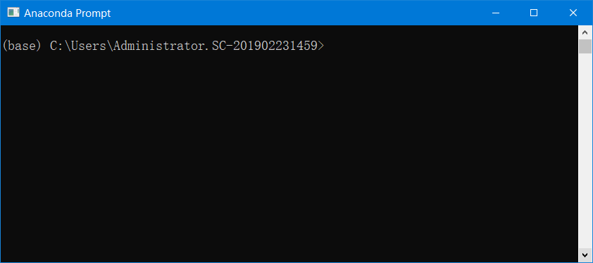
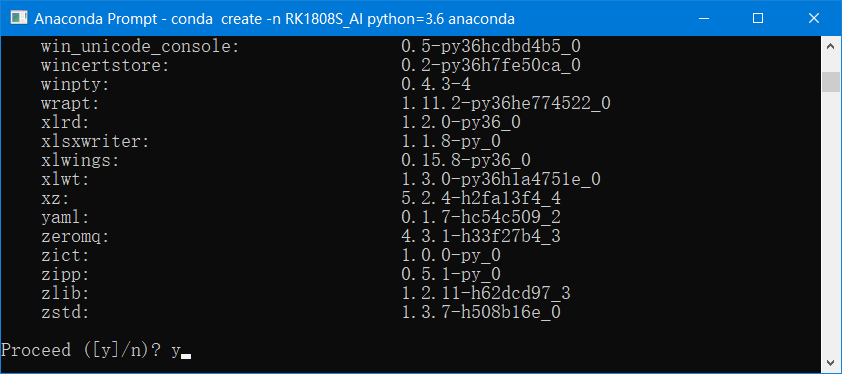
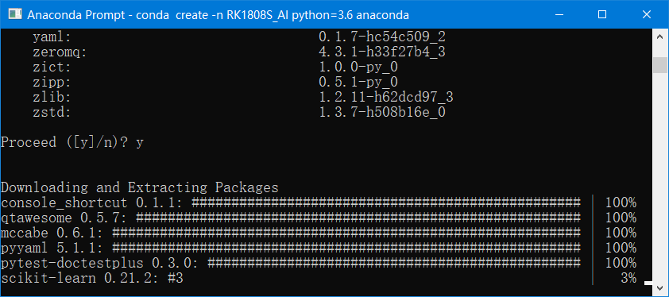
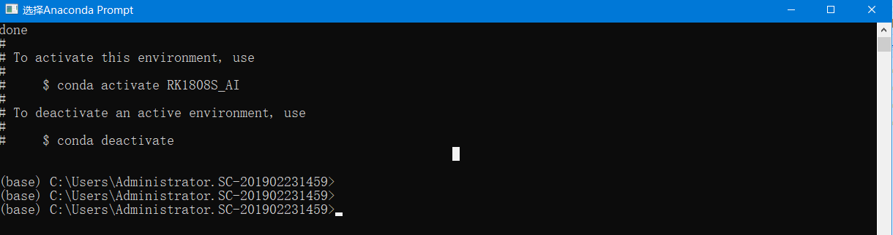
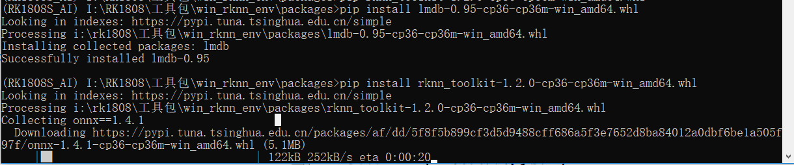

# RK1808S_AI计算棒—搭建Windows开发环境
[TOC]

## 0、引言
### 本文将实现 `Anaconda3`+`TensorFlow(1.15)`+`Python3.6`+`RKNN(计算棒专用接口)`+`VSCode`+`OpenCV-Python`
### 在Windows下面实现的可断点仿真环境搭建

> 主机：Windows10
> 
> VS Code版本
> 
	版本: 1.39.1 (user setup)
	提交: 88f15d17dca836346e787762685a40bb5cce75a8
	日期: 2019-10-10T23:31:28.683Z
	Electron: 4.2.10
	Chrome: 69.0.3497.128
	Node.js: 10.11.0
	V8: 6.9.427.31-electron.0
	OS: Windows_NT x64 10.0.17134
	VS Code插件：python （在扩展里面添加即可）


## 1、安装虚拟环境Anaconda3

### 1.1、下载安装
* [官网下载地址](https://www.anaconda.com/distribution/)
* 推荐到清华镜像站下载，好处：下载速度快，版本齐全，包括各个系统的都有-->[传送门](https://mirrors.tuna.tsinghua.edu.cn/anaconda/archive/)
* windows安装自然不用说，不断按Next，选择你的安装目录即可，过程不再赘述！

### 1.2、下载完成
完装完成后，可以在开始菜单看到：


### 1.3、创建专用虚拟环境

运行Anaconda Prompt：点击图标`Anaconda Prompt`即可进入Anaconda命令行环境：



此时，输入以下指令，可以开始国内镜像源是采用的清华大学开源软件镜像站:

    conda config --add channels https://mirrors.tuna.tsinghua.edu.cn/anaconda/pkgs/free/
    conda config --set show_channel_urls yes

此时，输入以下指令，可以开始创建我们专用的虚拟环境：

`
	conda create -n RK1808S_AI python=3.6.8 anaconda
`

按提示输入：`y`即可：



之后，便开始安装或者下载相应的包：




环境创建成功之后，就会出现如下图所示：




同时，开始菜单就会出现如下图所示：


## 2、安装TensorFlow

* 因为不是所有的电脑都是N卡，也不一定支持CUDA，所以我们选择安装TensorFlow CPU版本的，通用性更广一些。

* 激活步骤1中的虚拟环境，在`Anaconda Prompt`输入：`activate RK1808S_AI`即可启动步骤1中的环境；如果输入`deactivate`即出当前环境。方法二，可以在开始菜单中点击`Anaconda Prompt(RK1808S_AI)`，即可进入相应的环境。

* 将pip源改为清华大学源

```
    pip install pip -U
    pip config set global.index-url https://pypi.tuna.tsinghua.edu.cn/simple
```

* 如果您到 pip 默认源的网络连接较差，临时使用本镜像站来升级 pip：

`
	pip install -i https://pypi.tuna.tsinghua.edu.cn/simple pip -U
`


此时，输入以下指令，可以在线安装TensorFlow:
	
	pip install tensorflow==1.13.1
	


* 安装完成：


## 3、安装OpenCV-Python

`pip install opencv-python`


## 4、安装RKNN(AI计算棒的py接口)

* 切换到RKNN的whl包目录，手动执行安装即可，具体目录以你自己的为准：

```
    pip install lmdb-0.95-cp36-cp36m-win_amd64.whl
    pip install rknn_toolkit-1.2.0-cp36-cp36m-win_amd64.whl
```

先安装`lmdb-0.95-cp36-cp36m-win_amd64.whl`,再安装`rknn_toolkit-1.2.0-cp36-cp36m-win_amd64.whl`;其中安装lmdb就很快完成，但rknn需要依赖很多依赖项，安装比较慢，如下图：



完装完成，效果如下：


## 5、安装VSCode

* VSCode的安装就不再累述了，官网下载，三个操作系统支持

* 需要强调的是：VScode安装成功后，需要安装一些插件，此文必需有：python、中文语言包


## 6、VSCode使用集成化环境

* 打开VSCode并新增一个py文件，同时选择前文搭建好的版本即可：


* 书写相关代码时可以看到相应的接口提示：


### 进入单步调试界面，点击界面上的“调试”->“启动调试”或者快捷F5即可，一键即可进入调试环境：

