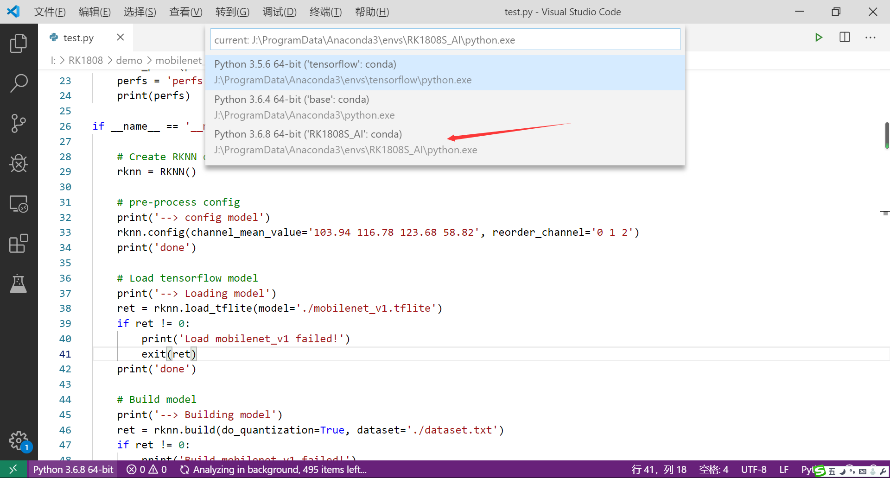

# RK1808S_AI计算棒—RK1808被动模式下mobilenet_v1模型测试
[TOC]

## 0、引言

#### 被动模式开发流程简介
被动模式下：RK1808 人工智能计算棒是一个通用AI加速器。主机端通过RKNN-Toolkit将模型及前处理后的数据传输给RK1808 人工智能计算棒，RK1808 人工智能计算棒完成推理，并把结果返回主控端，主机端进行后处理以及显示等操作。
更多关于被动模式开发流程的介绍，可以参考[官网wiki
](http://t.rock-chips.com/wiki.php?mod=view&id=64)

#### 这里以mobilenet_v1为例，在搭建好的windows环境下使用mobilenet_v1模型，示例实现的功能是对一张图片进行特征提取，并识别这张图片所属分类。

### 本文将实现基于上篇文章实现的 `Anaconda3`+`TensorFlow(1.15)`+`Python3.6`+`RKNN(计算棒专用接口)`+`VSCode`+`OpenCV-Python`环境下的mobilenet_v1模型测试

## 1、下载源代码

从官方FTP文件服务器下载mobilenet_v1压缩包，并解压出来：

    wget http://repo.rock-chips.com/rk1808/mobilenet_v1.tar.gz
    tar xvf mobilenet_v1.tar.gz	//win使用右键解压

## 2、源代码目录说明

以下是mobilenet_v1示例的目录结构及说明如下：

* dataset.txt: 包含测试图片路径的文本文件。

* dog_224x224.jpg: 作为mobilenet_v1示例的测试图片。

* mobilenet_v1.tflite: TensorFlow Lite模型文件。

* mobilenet_v1.rknn: rknn模型文件。由非rknn模型文件（这里是TensorFlow Lite模型）经过RKNN-Toolkit模型转换生成的该rknn模型文件。

* test.py: 示例运行脚本(包含rknn模型转换部分)。

* test_inference.py: 示例运行脚本（仅加载rknn模型进行推理）。

## 3、运行测试：

使用VScode打开`test.py` 文件，如图所示，选择正确的运行环境：

运行效果：

    --> config model
    done
    --> Loading model
    done
    --> Building model
    done
    --> Export RKNN model
    done
    --> Init runtime environment
    done
    --> Running model
    mobilenet_v1
    -----TOP 5-----
    [156]: 0.8837890625
    [155]: 0.0677490234375
    [188 205]: 0.00867462158203125
    [188 205]: 0.00867462158203125
    [263]: 0.0057525634765625
    
    done
    --> Begin evaluate model performance
    ========================================================================
       Performance
    ========================================================================
    FPS: 136.30
    ========================================================================
    
    done

## 4、结果说明：

根据以上执行结果可知，TOP5表示模型预测出来的排名前5的分类的结果，其中[156]表示狗的标签，0.8837890625表示预测为该标签的概率，可以看出预测结果为狗的可能性最大，从测试图片（dog_224x224.jpg）可以看出预测结果是准确的。