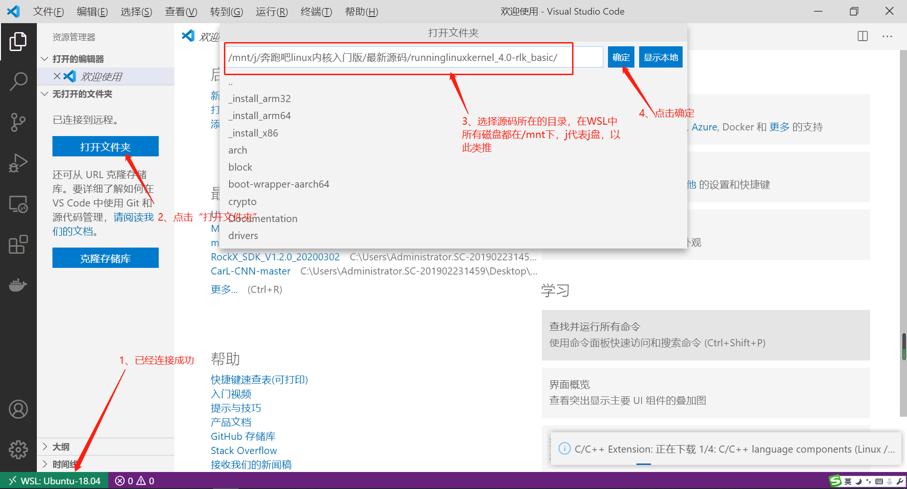
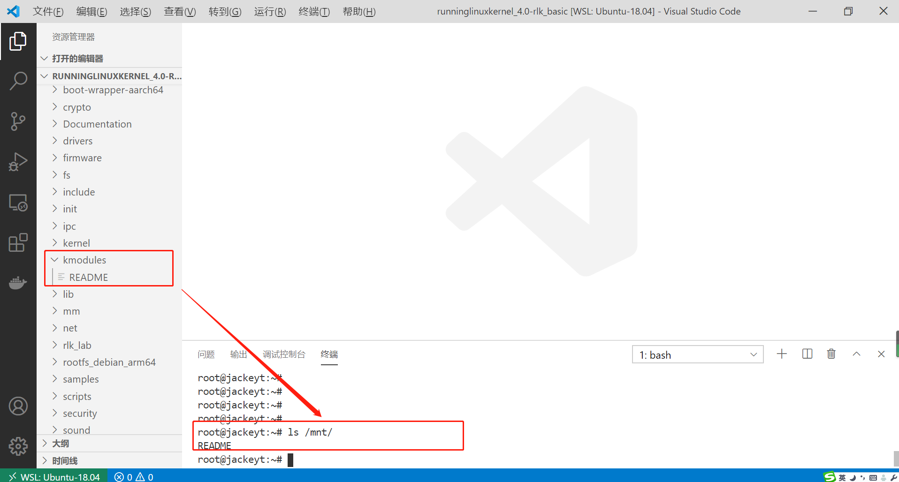
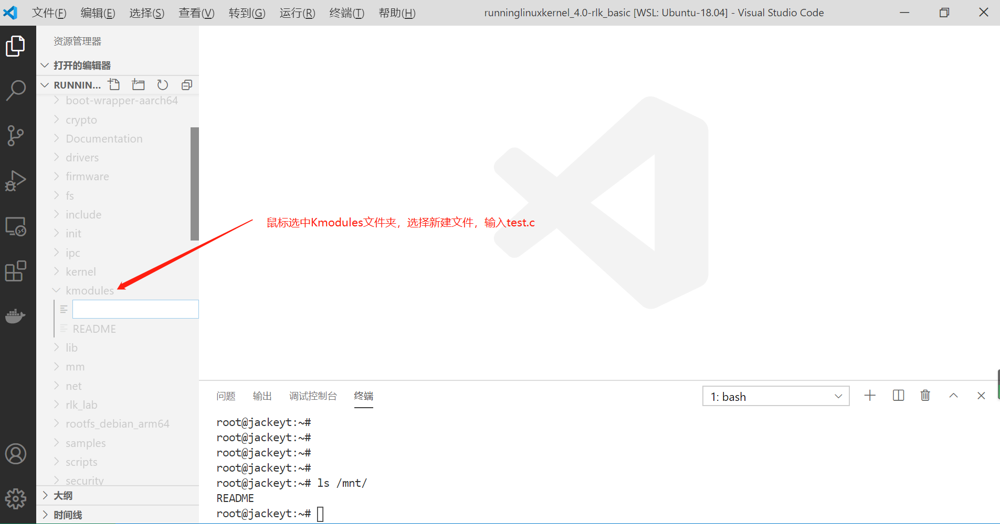

# [首发][史上最详细]VSCode搭建Linux Kernel单步调试IDE环境


[TOC]

## 0.环境介绍
> 主机：Windows10

> 版本:Windows10专业版

> 版本号:1909

> 安装日期:2019/10/16

> 操作系统版本18363900

> WSL版本：WSL1（或者2）ubuntu18.04

> 编译器：aarch64-linux-gnu-gcc (gcc version 7.3.0)

> 调试器：主机：aarch64-linux-gnu-gdb (gcc version 7.3.0)    开发板：gdbserver(7.3.0)

#### VS Code版本

```
版本: 1.46.1 (user setup)
提交: cd9ea6488829f560dc949a8b2fb789f3cdc05f5d
日期: 2020-06-17T21:13:20.174Z
Electron: 7.3.1
Chrome: 78.0.3904.130
Node.js: 12.8.1
V8: 7.8.279.23-electron.0
OS: Windows_NT x64 10.0.18363
```

## 1.准备工作

### 1.1、安装WSL

下载安装WSL程序，如本例中提到的：[ubuntu18.04](https://wsldownload.azureedge.net/CanonicalGroupLimited.Ubuntu18.04onWindows_1804.2018.817.0_x64__79rhkp1fndgsc.Appx)

### 1.2、安装VSCode

Windows版的VSCode，[下载地址](https://code.visualstudio.com/Download#)

### 1.3、安装VSCode插件

> 在扩展里面添加即可

* C/C++ (必选)
* C/C++ Intellisense(可选)
* C/C++ Snippets(可选)
> Remote(必选三件套，微软官方出品)
> 
* Remote-WSL
* Remote-SSH
* Remote-Containers
> Embedded Linux Dev(设备树插件)
> Kconfig(设备树插件依赖)

### 1.4、下载Linux内核代码

推荐下载：https://github.com/figozhang/runninglinuxkernel_4.0

推荐理由：

* 1、4.0版本非常经典，适合学习
* 2、该代码仓库是书籍的配套代码，比较完善
* 3、该代码仓库已经配置好了各种比较烦杂的环境，如：qemu网络桥接、根文件系统、qemu共享文件夹等
* 4、最后强调：前期配套开发环境，不需要重复造轮子，纠结于小细节，先站在巨人肩上，整套流程熟悉之后，可以随时替换、修改这套环境

### 1.5、搭建Linux内核编译环境

> Ubuntu18.04(WSL)相关问题可直接百度查找

* Linux环境：ubuntu18.04 (WSL)
* Linux安装依赖包：

```
    sudo apt-get install libncurses5-dev libssl-dev build-essential openssl bison bc flex  git
```

> 当然你可以使用如下命令来安装编译内核需要的所有依赖包。 

```
    sudo apt build-dep linux-image-generic
```

* Linux环境安装编译链：
> 因为linux 内核版本原因，因为所用版本为4.0，所以需要5.x的gcc交叉链
 
> 一次性安装ARM32/64所用的交叉链

`sudo apt install gcc-5-aarch64-linux-gnu  gcc-5-arm-linux-gnueabihf` 

> 如果系统中已经有其他版本的gcc交叉链，可使用`update-alternatives`进行管理,可以参考：

	update-alternatives 命令的主要参数如下
    update-alternatives --install <link> <name> <path> <priority> 
    link：指向/etc/alternatives/<name>的符号引用 
    name：链接的名称 
    path：这个命令对应的可执行文件的实际路径 
    priority：优先级，在 auto 模式下，数字大的优先级比较高。


## 2.VSCode+WSL搭建IDE

* 到这里我们已经完成了WSL、VScode及其插件的安装，接下来可以使用VSCode和WSL进行编译、调试

### 2.1、使用VSCode连接WSL





### 2.2、开始编译内核

* 其实该源码目录已经集成好编译、运行、调试所需要的脚本
* 该源码已经支持ARM32+debian或ARM64+debian，本例以为ARM64+Debian为例

在终端中运行：

```
	./run_debian_arm64.sh build_kernel
```


* 编译完成：


### 2.3、编译Rootfs

* 编译 ARM64 版本的Debian 系统 rootfs 

```
    $sudo ./run_debian_arm64.sh build_rootfs 
```

* 注意：这里需要使用 root 权限。 
* 编译完成后会生成一个 rootfs_debian_arm64.ext4 的文件系统。 
* 注意：在WSL1下，有两个BUG：1、无法mount 2、无法生成ext4镜像，如下图所示，该BUG在WLS2中可以解决。


* 所以，WSL1版本的环境，可以在虚拟机VM或者其他环境下自行打包，或者可以使用打包好的ARM64_Rootfs.ext4,点击下载。

### 2.4、运行Rootfs

```
$ ./run_debian_arm64.sh run 
```

* 注意：运行此命令不需要 root 权限。

* 注意：用户名：root 密码:123


* 成功运行之后，如下图所示：


* 成功登录之后，如下图所示：


### 2.5、测试Debian系统

因为是基于Debian系统，且网络等都是已经搭建好的，直接可以使用APT等命令进行安装在线包，以下为简单测试：


QEMU 虚拟机可以通过VirtIO-NET 技术来生成一个虚拟的网卡，并且通过 NAT网 络桥接技术和主机进行网络共享。首先使用 ifconfig 命令来检查网络配置。 可以看到生成了一个名为 eth0 的网卡设备，分配的 IP 地址为：`10.0.2.15`。 通过` apt update` 命令来更新 Debian 系统的软件仓库。


### 2.6、主机和 QEMU 虚拟机之间共享文件

> 主机和 QEMU 虚拟机可以通过NET_9P 技术进行文件共享，这个需要 QEMU 虚 拟机的 Linux 内核使能 NET_9P 的内核模块。本平台已经支持主机和 QEMU 虚拟机的共享文件，可以通过如下简单方法来测试。

* 共享目录为:kmodules
* 系统目录为:mnt

> 效果如下图所示：




* 在 kmodules 目录下面新建一个 test.c 文件。 




##### 我们在后续会经常利用这个特性，比如把编译好的内核模块或者内核模 块源代码放入QEMU 虚拟机。


## 3. 一键单步调试内核

> 直到这一步，已经完成了基于WSL+VScode的环境搭建，这样就可以得到一个集终端、文件管理器、git管理器、运行调试等等等一体化的IDE环境了，这样就可以在纯WIN10下实现单步调试内核的目的了，非常方便。

### 3.1、配置内核调试命令


内核的编译调试命令已经全部打包进了脚本文件，感兴趣的童鞋可以去深入了解一下，这里以ARM64为例：


```
./run_debian_arm64.sh run debug

```


**此时，gdbserver已经在1234端口等待连接！**

### 3.2、配置VSCode Debug选项

选择：运行（R）-> 添加配置 -> C++（GDB/LDB）

如下动图所示：


添加如下配置信息：

```
{
    // 使用 IntelliSense 了解相关属性。 
    // 悬停以查看现有属性的描述。
    // 欲了解更多信息，请访问: https://go.microsoft.com/fwlink/?linkid=830387
    "version": "0.2.0",
    "configurations": [
        {
            "name": "(gdb) 启动",
            "type": "cppdbg",
            "request": "launch",
            "program": "${workspaceFolder}/vmlinux",
            "args": [],
            "stopAtEntry": true,
            "cwd": "${workspaceFolder}",
            "environment": [], 
            "externalConsole": true,// 调试时是否显示控制台窗口，一般设置为true显示控制台
            "MIMode": "gdb",
            "miDebuggerPath":"/usr/local/bin/aarch64-linux-gnu-gdb",
            "miDebuggerServerAddress": "192.168.1.111:1234",
            "setupCommands": [
                {
                    "description": "为 gdb 启用整齐打印",
                    "text": "-enable-pretty-printing",
                    "ignoreFailures": true
                }
            ]
        }
    ]
}
```

* 注意:192.168.1.111 是本地WIN10的IP也就是WSL的IP
* 这里有个小小的BUG，必须输入IP地址，不能使用localhost顶替（在其他环境下是可以的）
* gdb路径："miDebuggerPath":"/usr/local/bin/aarch64-linux-gnu-gdb"
* gdb监听端口："miDebuggerServerAddress": "192.168.1.111:1234",1234与上一小节中的Listen端口一致！


### 3.3、一键调试

经过3.1、3.2的配置已经实现了调试的前置条件，现只需按下F5键就可以实现一键调试了，如下图所示：


### 3.4、一键调试


## 4.单步调试应用层+内核

## 5.单步调试modules+内核

## 6.单步调试python程序+内核

