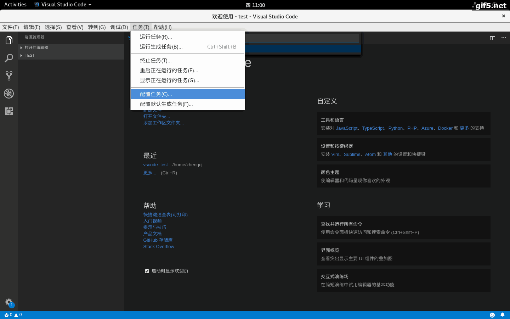
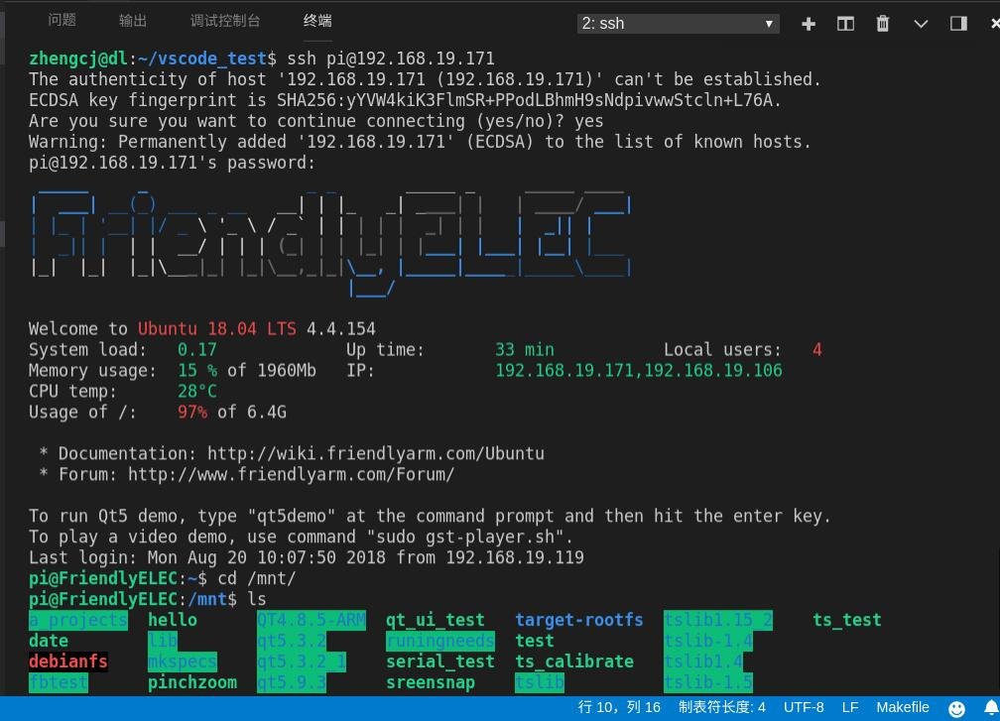

# VS Code搭建ARM Linux Makefile工程IDE（C/C++）[史上最详细]

[TOC]

## 0.环境介绍
> 主机：ubuntu 18.04(LTS)
> 开发板主控：RK3399(ARM 64bit)
或者其他任意一款只有对应的工具链即可
> OS:Linux version 4.4.143
> 开发板IP：192.168.19.171
> 编译器：aarch64-linux-gnu-gcc (gcc version 7.3.0)
> 调试器：主机：aarch64-linux-gnu-gdb (gcc version 7.3.0)    开发板：gdbserver(7.3.0)
> VS Code版本
    版本 1.23.1
    提交 d0182c3417d225529c6d5ad24b7572815d0de9ac
    日期 2018-05-10T16:04:33.747Z
    Shell 1.7.12
    渲染器 58.0.3029.110
    Node 7.9.0
    架构 x64
> VS Code插件：C/C++ （在扩展里面添加即可）

## 1.简单的C/C++ Makefile工程

### 1.1 整体工程预览

```
.
├── add.c
├── makefile
├── sub.c
└── test.h
```

### 1.2 add.c
```
#include "test.h"
#include <stdio.h>
 
int add(int a, int b)
{
    return a + b;
}
 
int main()
{
    printf(" 2 + 3 = %d\n", add(2, 3));
    printf(" 2 - 3 = %d\n", sub(2, 3));
    return 1;
}

```

### 1.3  sub.c

```
#include "test.h"
 
int sub(int a, int b)
{
    return a - b;
}
```


### 1.4  test.h

```
#ifndef _TEST_H
#define _TEST_H
 
int add(int a, int b);
int sub(int a, int b);
#endif

```



### 1.5  makefile

```
#板子对应的交叉链，可以换成其他对应的版本即可
CC=aarch64-linux-gnu-gcc

test: add.o sub.o
	$(CC) -o test add.o sub.o
 
add.o: add.c test.h
	$(CC) -c add.c
 
sub.o: sub.c test.h
	$(CC) -c sub.c    
    
clean:
	rm -rf test
	rm -rf *.o

```

## 2. VS Code开发环境搭建

VS Code的灵活性在于可以完全自定义搭建一个适合自己用的开发环境，其中包括可以自定义编译任务，调试任务。

### 2.1  VS Code导入工程

直接打开VS Code，再选择“打开文件夹”，打开对应工程的文件夹即可

### 2.2  VS Code自定义生成编译任务

如上面提到，VS Code的灵活性在于自定义编译任务，而VS Code中用于描述编译任务的定义为：`tasks.json`，所以自定义编译任务就是编写`tasks.json`。首先，编写`tasks.json`有以下两种方法：
1. 在View下打开命令面板(Command Pallette)（快捷键`Ctrl+Shift+p`），搜索Task，选择Tasks:Configure Task，之后选择Others，生成tasks.json文件。
2. 在菜单栏上面，选择任务(T)-->配置任务(C)...-->使用模板创建tasks.json-->Others，生成tasks.json文件。


#### 2.2.1 至简的`tasks.json`参考
```
{
    // See https://go.microsoft.com/fwlink/?LinkId=733558
    // for the documentation about the tasks.json format
    "version": "2.0.0",
    "tasks": [
        {
           "label": "shell",//任务名称，和launch.json中一致，即执行这个任务
            "type": "shell",//任务类型，即执行该任务的类型，填shell表示在命令行中执行的任务
            "command": "make",//执行命令是make，即调用makefile进行编译若直接使用gcc命令行，替换即可
            "problemMatcher": [
                "$gcc"
            ],
            "group": {
                "kind": "build",
                "isDefault": true
            }
        }
    ]
}

```

#### 2.2.2 添加出错信息的`tasks.json`参考
```
{
    // See https://go.microsoft.com/fwlink/?LinkId=733558
    // for the documentation about the tasks.json format
    "version": "2.0.0",
    "tasks": [
        {
            "label": "shell",
            "type": "shell",
            "command": "make",
                //这个字段是发生错误时，信息的匹配
            "problemMatcher": {
                "owner": "cpp",
                "fileLocation": [
                    "relative",
                    "${workspaceFolder}"
                ],
                "pattern": [
                    {
                        "regexp": "^([^\\s].*)$",
                        "file": 1
                    },
                    {
                        "regexp": "^\\s+(\\d+):(\\d+)\\s+(error|warning|info)\\s+(.*)\\s\\s+(.*)$",
                        "line": 1,
                        "column": 2,
                        "severity": 3,
                        "message": 4,
                        "code": 5,
                        "loop": true
                    }
                ]
            },
            "group": {
                "kind": "build",
                "isDefault": true
            }
        }
    ]
}
```

### 2.2  VS Code自定义生成调试任务

如上面提到，VS Code的灵活性在于自定义调试任务，而VS Code中用于描述调试任务的定义为：`launch.json`，所以自定义编译任务就是编写`launch.json`。首先，编写`launch.json`可以参考以下方法：

在菜单栏上面，选择调试(D)-->打开配置(C)...-->C++(GDB/LLDB)，生成`launch.json`文件。

#### 2.2.1 生成的`launch.json`

系统自动生成的模块如下：

```
{
    // 使用 IntelliSense 了解相关属性。 
    // 悬停以查看现有属性的描述。
    // 欲了解更多信息，请访问: https://go.microsoft.com/fwlink/?linkid=830387
    "version": "0.2.0",
    "configurations": [
        {
            "name": "(gdb) Launch",
            "type": "cppdbg",
            "request": "launch",
            "program": "enter program name, for example ${workspaceFolder}/a.out",
            "args": [],
            "stopAtEntry": false,
            "cwd": "${workspaceFolder}",
            "environment": [],
            "externalConsole": true,
            "MIMode": "gdb",
            "setupCommands": [
                {
                    "description": "Enable pretty-printing for gdb",
                    "text": "-enable-pretty-printing",
                    "ignoreFailures": true
                }
            ]
        }
    ]
}

```
#### 2.2.2 `launch.json`重要项修改添加

可以看到VS Code帮我们生成的文件里面已经完成大部分工作，只需添加修改相应的必要项即可：

1. 修改可执行文件的位置： `"program": "enter program name, for example ${workspaceFolder}/a.out",
`修改成我们make编译完成的二进制文件，如本次示例中的  `"program": "${workspaceFolder}/test",
`
2. 修改所用gdb调试器所在的位置，添加选项：`"miDebuggerPath":"/usr/bin/aarch64-linux-gnu-gdb",
`  建议最好使用绝对路径，如本例所示
3.  修改目标开发板的IP和端口，添加选项：`"miDebuggerServerAddress": "192.168.19.171:10000",
`如本例所示
4. 其他修改：`"preLaunchTask":"shell",
` 与之前tasks.json中的任务名称要一致，表示在调试前执行的前置任务，当然，除了执行make，还可以执行其他系统命令，如将编译生成文件复制到目标开发板上等等。。。

#### 2.2.3 `launch.json`参考
```
{
    // 使用 IntelliSense 了解相关属性。 
    // 悬停以查看现有属性的描述。
    // 欲了解更多信息，请访问: https://go.microsoft.com/fwlink/?linkid=830387
    "version": "0.2.0",
    "configurations": [
        
        {
            "name": "(gdb) Launch",
            "type": "cppdbg",
            "request": "launch",
            "program": "${workspaceFolder}/test",
            "args": [],
            "stopAtEntry": true,
            "cwd": "${workspaceFolder}",
            "environment": [],
            "externalConsole": true,
            "MIMode": "gdb",
            "miDebuggerPath":"/usr/bin/aarch64-linux-gnu-gdb",
            "miDebuggerServerAddress": "192.168.19.171:10000",
            "preLaunchTask":"shell",
            "setupCommands": [
                {
                    "description": "Enable pretty-printing for gdb",
                    "text": "-enable-pretty-printing",
                    "ignoreFailures": true
                }
            ]
        }
    ]
}
```

## 3. 编译&调试

### 3. 1 调试前的准备

为了使开发主机上的生成的可执行文件可以复制到目标开发板上，可以通过网络的形式进行传输，毕竟GDB也是基于网络的，这样就更方便些，例如本文所用的方式NFS：已知在开发主机上已经有NFS服务器了，目录为 `/home/dl/share/nfs`，IP地址为：192.168.19.188  。那么只需要在开发板上挂载NFS服务器即可，用如下命令：
```
mount -t nfs -o nolock 192.168.19.188:/home/dl/share/nfs    /mnt
```
> 将PC的NFS目录挂载到开发板的mnt目录 。

因此，需要每次将生成的目标文件复制到nfs目录下，有很多种方式，可以手动用命令进行，因此VS Code中已经集成了终端，可以直接用，又或者修改makefile，添加make install 之类的命令，也是可以的，方法有很多，举个简陋的例子（makefile）：
```
install:
    cp -raf test /home/dl/share/nfs
```
然后，修改`tasks.josn`，让它执行`make` 之后再执行`make install `：
```
.............
 "tasks": [
        {
            "label": "shell",
            "type": "shell",
            "command": "make;make install",
.............
```

### 3.2 开始调试

* VS Code还有一个好处就是集成了linux sh终端，使用VS Code终端界面，在里面连开发板的SSH，就不再需要在调试的过程中不断的进行界面切换了，按上文所提开发板的IP为：192.168.19.171,因此，在VS Code中用SSH相连即可：

* 按前面的步骤，已经可以实现在开发板的/mnt目录下面实现数据程序的共享了，在开发板的/mnt目录下面输入命令：`gdbserver :10000 test` 即可实现在开发板监听`10000`端口的GDB调试事件了。

* 在VS Code下面按下快捷键：`Ctrl+Shift+B` 即可实现调用makefile对整个工程进行make 并且make install ，效果如下：


## 4. 演示效果


