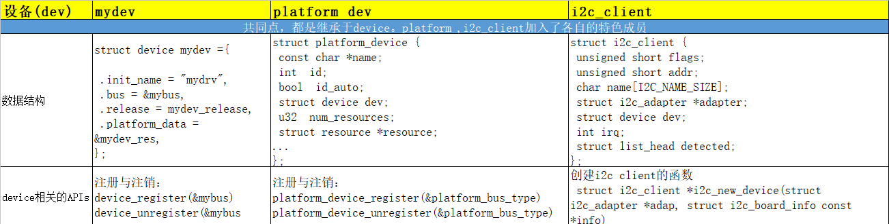

从上述表格中，我们不难看出，总线：mybus(自己写的)，platform(平台总线)，IIC总线都是基于bus----driver----device的模型

>对于总线而言，无非就是从struct  bus_type派生出来的一个实例；
>对于driver而言，基本都是继承struct device_driver而扩展出来的；
>对于device而言，无非就是从struct device而扩展出来的。

