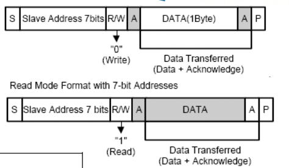
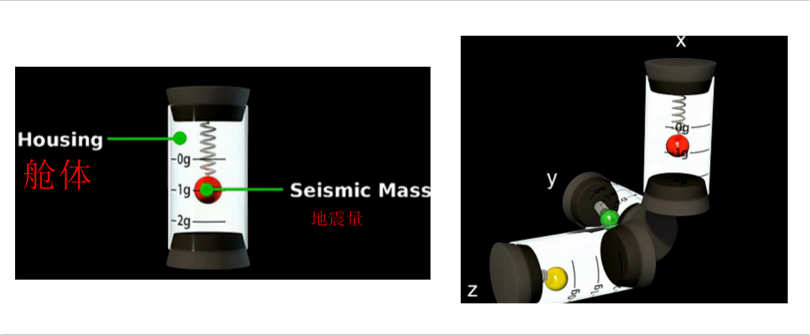

# 驱动第三天---总线 #

[TOC]

----------

----------

## 1. 总线的基本概念 ##

1.1 Linux设备驱动模型的由来

1. 实现入口函数` xxx_init()`和卸载函数` xxx_exit()`
2. 申请设备号 ` register_chrdev` (与内核相关)
3. 利用udev/mdev机制创建设备文件(节点) `class_create, device_create` (与内核相关)
4. 硬件部分初始化

	> io资源映射 ioremap,内核提供gpio库函数 (与硬件相关)
	> 
	> 注册中断(与硬件相关)	
5. 构建 file_operation结构 (与内核相关)
6. 实现操作硬件方法  xxx_open,xxx_read,xxxx_write

## 2. Sysfs文件系统 ##

:
:

    block：用于管理块设备，系统中的每一个块设备会在该目录下对应一个子目录。
    bus：用于管理总线，每注册一条总线，在该目录下有一个对应的子目录。
    其中，每个总线子目录下会有两个子目录：devices和drivers。
    devices包含系统中所有属于该总线的的设备。
    class：将系统中的设备按功能分类。
    dev：该目录包含已注册的设备号（设备节点)的视图，包括char和block
    kernel：内核中的相关参数。
    module：内核中的模块信息。
    fireware：内核中的固件信息。
    fs：描述内核中的文件系统。

## 3. 写一个自己的总线驱动 ##
  
写一个自己的总线模型，实现如下图的功能：

### 3.1 写一个自己的总线驱动——bus ###
1. 数据类型

    struct bus_type {
    
    const char		*name;  //假如name =xxx cat /sys/bus/XXX
    
    int (*match)(struct device *dev, struct device_driver *drv);
    	
    ........

    }

2. API
2.1 创建

    int  bus_register(struct bus_type *bus);

 
2.2 注销

	void bus_unregister(struct bus_type *bus);

### 3.2 写一个自己的总线驱动——driver ###

1. 数据类型

	    struct device_driver {
    	const char		*name;
    	struct bus_type		*bus;
   
    
    	int (*probe) (struct device *dev);
    	int (*remove) (struct device *dev);
    
    	};
    

### 3.3 写一个自己的总线驱动——device ###

1. 数据类型

    	struct device{
    

    	struct kobject kobj;//代表一切对象的父类，那么，在这里引了kobject，说明device是继承kobject,
    	const char		*init_name; /* device 的名字 */
    	
    
    	struct bus_type	*bus;		/* 需要挂接上的bus总线 mybus */
    	struct device_driver *driver;	/* 与之（内核做的）已经匹配成功的drv */
    	void		*platform_data;	/* 万能型 指针 指向dev的自定义的某些数据，或者说用于drv与dev传递数据的一个载体*/
    	}

2 APIs

2.1 创建

	int device_register(struct device *dev)

2.2 注销

	void device_unregister(struct device *dev)

### 3.4 如何实现总线的匹配 ###

如何实现总线匹配，匹配成功之后会自动调用driver的probe方法：

> 1， 实现bus对象中 match方法 
> 
> 2， 保证driver和device中名字要一样
> 	
	//如果返回值 为1 代表匹配成功，否则不成功
	int mybus_match(struct device *dev, struct device_driver *drv)
	{

		printk("-------------%s------------\n",__FUNCTION__);
	
		if( strncmp(dev->kobj.name ,    drv->name ,  sizeof(drv->name))  ==  0   )
		{
			printk("match ok\n");
			return 1;
		}
		else 
		{
			printk("match error\n");
			return 0;
		}
	}

## 4. 平台总线(platform)的基本概念 ##

平台总线模型：

##### 为什么会有平台总线： #####

1 从厂商的角度出发

	用于平台升级：三星：　2410, 2440, 6410, s5pc100  s5pv210  4412
		硬件平台升级的时候，部分的模块的控制方式，基本上是类似的
		但是模块的地址是不一样

		gpio控制逻辑： 1， 配置gpio的输入输出功能： gpxxconf
					  2， 给gpio的数据寄存器设置高低电平： gpxxdata
					      逻辑操作基本上是一样的
					      但是地址不一样
		
		uart控制：1,设置8n1,115200, no AFC
					UCON,ULCON, UMODOEN, UDIV
				
					"逻辑基本上是一样的,但是地址不一样"

	问题：
	当soc升级的时候， 对于相似的设备驱动，需要编写很多次(如果不用平台总线)
	但是会有大部分重复代码

	解决：引入平台总线	
		device(中断/地址)和driver(操作逻辑) 分离
		在升级的时候，只需要修改device中信息即可(中断/地址)
		实现一个driver代码能够驱动多个平台相似的模块，并且修改的代码量很少

2 从使用者的角度出发

## 5. 平台总线(platform)编程接口 ##

平台总线中的三元素：

1， bus：邮bus衍生出来的platform_bus:不需要自己创建，开机的时候自动创建

		struct bus_type platform_bus_type = {
			.name		= "platform",
			.dev_groups	= platform_dev_groups,
			.match		= platform_match,
			.uevent		= platform_uevent,
			.pm		= &platform_dev_pm_ops,
		};

	匹配方法：

	static int platform_match(struct device *dev, struct device_driver *drv)
	{
		struct platform_device *pdev = to_platform_device(dev);
		struct platform_driver *pdrv = to_platform_driver(drv);
	
		/* Attempt an OF style match first */
		if (of_driver_match_device(dev, drv))
			return 1;
	
		/* Then try ACPI style match */
		if (acpi_driver_match_device(dev, drv))
			return 1;
	
		/* Then try to match against the id table */
		if (pdrv->id_table)
			return platform_match_id(pdrv->id_table, pdev) != NULL;
	
		/* fall-back to driver name match */
		return (strcmp(pdev->name, drv->name) == 0);
	}

		。。。。。。dts   acpi
		1，优先匹配pdriver中的id_table,里面包含了支持不同的平台的名字
		2，直接匹配driver中名字和device中名字

		

2，device对象：

	struct platform_device {
		const char	*name;  //用于做匹配
		int		id;  // 一般都是直接给-1
		struct device	dev; // 继承了device父类
		u32		num_resources; // 资源的个数
		struct resource	*resource; // 资源：包括了一个设备的地址和中断
	}

资源对象resource:
	
	struct resource {
	resource_size_t start;
	resource_size_t end;
	const char *name;
	unsigned long flags;
	struct resource *parent, *sibling, *child;
	};

注册和注销

		int  platform_device_register(struct platform_device * pdev)；
		void  platform_device_unregister(struct platform_device * pdev)

3，driver对象

	struct platform_driver {
			int (*probe)(struct platform_device *); //匹配成功之后被调用的函数
			int (*remove)(struct platform_device *);//device移除的时候调用的函数
			struct device_driver driver; //继承了driver父类
								|
								const char		*name;
			const struct platform_device_id *id_table; //如果driver支持多个平台，在列表中写出来
	}
	注册和注销
		int platform_driver_register(struct platform_driver *drv);
		void platform_driver_unregister(struct platform_driver *drv)

4， drv如何去获取dev中的数据
> 获取资源数据
> 
    int platform_get_irq(struct platform_device * dev,unsigned int num)										
    struct resource * platform_get_resource_byname(struct platform_device * dev,
    					unsigned int type,const char * name)

## 5. 写一个platform led驱动 ##
编写代码：　编写一个能在多个平台下使用的led驱动

1，注册一个platform_device,定义资源：地址和中断

    struct resource {
    	resource_size_t start; // 开始
    	resource_size_t end; //结束
    	const char *name; //描述，自定义
    	unsigned long flags; //区分当前资源描述的是中断(IORESOURCE_IRQ)还是内存（IORESOURCE_MEM）
			#define IORESOURCE_MEM		0x00000200
			#define IORESOURCE_REG		0x00000300	/* Register offsets */
			#define IORESOURCE_IRQ		0x00000400
    	struct resource *parent, *sibling, *child;
    };

2，注册一个platform_driver，实现操作设备的代码

    注册完毕，同时如果和pdev匹配成功，自动调用probe方法：
    		probe方法： 对硬件进行操作
    				a，注册设备号，并且注册fops--为用户提供一个设备标示，同时提供文件操作io接口
    				b， 创建设备节点
    				c， 初始化硬件
    							ioremap(地址);  //地址从pdev需要获取
    							readl/writle();
    				d，实现各种io接口： xxx_open, xxx_read, ..
			获取资源的方式：		
			//获取资源
			// 参数1: 从哪个pdev中获取资源
			// 参数2:  资源类型
			// 参数3: 表示获取同种资源的第几个
				struct resource *platform_get_resource(struct platform_device *dev, unsigned int type, unsigned int num)

3，platform 获取中断（irq）资源
/**
 * platform_get_irq - get an IRQ for a device
 * @dev: platform device
 * @num: IRQ number index
 */
int platform_get_irq(struct platform_device *dev, unsigned int num)

4 ，platform id_table的定义：

    struct platform_device_id {
        char name[PLATFORM_NAME_SIZE];
        kernel_ulong_t driver_data;
    };

# IIC总线驱动 #

主要内容：

1. i2c协议和时序
1. i2c子系统软件框架
1. i2c从设备驱动编写方式--不考虑具体的硬件
1. mpu6050硬件连接，陀螺仪和加速度工作原理，它们的应用
1. mpu6050数据和获取
1. mpu6050从设备驱动编写

## 1 i2c协议和时序 ##

IIC通讯波形图:

IIC协议:

## 2 i2c子系统软件框架 ## ##

	应用
	------------------------------------------
	i2c driver:从设备驱动层
		 需要和应用层进行交互
		 封包数据，不知道数据是如何写入到硬件

	------------------------------------------
	i2c 核心层：维护i2c 总线，包括i2c driver, i2c client链表
	drivers/i2c/i2c-core.c
	---------------------------------------------------
	i2c adapter层：i2c控制层，初始化i2c控制器
			完成将数据写入或读取-从设备硬件
			不知道数据具体是什么，但是知道如何操作从设备
	drivers/i2c/busses/i2c-s3c2410.c
	================================================================

去内核确定：i2c硬件驱动代码是否加入内核一起编译

	make menuconfig
		Device Drivers  --->
			-*- I2C support  ---> //编译i2c-core.c
				I2C Hardware Bus support  --->
					<*> S3C2410 I2C Driver // i2c-s3c2410.c

## 3  I2c子系统中涉及到的设备树文件： ##
	
> 查看原理图：MPU6050挂载至 I2C_5

>查看6050datasheet：如果AD0是高电平的话，那么，mpu6050的地址就是0x69,否则AD0为低时候，就是0x68

设备树：

控制器对应的设备树：arch/arm/boot/dts/exynos4.dtsi

		  i2c_0: i2c@13860000 {
                #address-cells = <1>;
                #size-cells = <0>;
                compatible = "samsung,s3c2440-i2c";
                reg = <0x13860000 0x100>;
                interrupts = <0 58 0>;
                clocks = <&clock 317>;
                clock-names = "i2c";
                pinctrl-names = "default";
                pinctrl-0 = <&i2c0_bus>;
                status = "disabled";
        };

		i2c_5: i2c@138B0000 {
                #address-cells = <1>;
                #size-cells = <0>;
                compatible = "samsung,s3c2440-i2c";
                reg = <0x138B0000 0x100>;
                interrupts = <0 63 0>;
                clocks = <&clock 322>;
                clock-names = "i2c";
                status = "disabled";
        };

我们用的：	arch/arm/boot/dts/exynos4412-fs4412.dts

		i2c@13860000 {
                #address-cells = <1>;
                #size-cells = <0>;
                samsung,i2c-sda-delay = <100>;
                samsung,i2c-max-bus-freq = <20000>;
                pinctrl-0 = <&i2c0_bus>;
                pinctrl-names = "default";
                status = "okay";
			 	s5m8767_pmic@66 {
                    	compatible = "samsung,s5m8767-pmic";
                    	reg = <0x66>;
						...........
						};
				};

我们自己做一个设备树节点，来描述mpu6050的信息：

	i2c控制器地址0-8组 共9组设备
		0x1386_0000, //0
		0x1387_0000,
		0x1388_0000, 
		0x1389_0000,
		0x138A_0000,
		0x138B_0000, ------ MPU6050
		0x138C_0000, 
		0x138D_0000, 
		0x138E_0000,//8

i2C_5的设备树节点：

	i2c@138B0000{
				#address-cells = <1>;
                #size-cells = <0>;
                samsung,i2c-sda-delay = <100>;
                samsung,i2c-max-bus-freq = <20000>;
                pinctrl-0 = <&i2c5_bus>;
                pinctrl-names = "default";
                status = "okay";

				mpu6050@68 {
                    	compatible = "InvenSense,mpu6050";
                    	reg = <0x68>;
						};

		};

编译设备树源码：

	make dtbs

烧写：。。。。。。。

## 4  i2c driver驱动的编写

> a， 添加i2c client的信息，必须包含在控制器对应的节点中
> 
> b，直接编写i2c driver
> 
> 	1，构建i2c driver，并注册到i2c总线
> 	
> 	2，实现probe：
> 		|
> 		申请设备号，实现fops
> 		创建设备文件
> 		通过i2c的接口去初始化i2c从设备

	
几个常用的对象：

	struct i2c_driver {//表示是一个从设备的驱动对象
		int (*probe)(struct i2c_client *, const struct i2c_device_id *);
		int (*remove)(struct i2c_client *);
		struct device_driver driver; //继承了父类
					|
					const struct of_device_id	*of_match_table;
		const struct i2c_device_id *id_table;//用于做比对，非设备树的情况
	}
	注册和注销
		int i2c_add_driver( struct i2c_driver *driver);
		void i2c_del_driver(struct i2c_driver *);

	struct i2c_client {//描述一个从设备的信息,不需要在代码中创建，因为是由i2c adapter帮我们创建
		unsigned short addr;		//从设备地址，来自于设备树中<reg>
		char name[I2C_NAME_SIZE]; //用于和i2c driver进行匹配，来自于设备树中compatible
		struct i2c_adapter *adapter;//指向当前从设备所存在的i2c adapter
		struct device dev;		// 继承了父类
	};
	创建i2c client的函数
	struct i2c_client *i2c_new_device(struct i2c_adapter *adap, struct i2c_board_info const *info)

	struct i2c_adapter {//描述一个i2c控制器，也不是我们要构建，原厂的代码会帮我们构建
		const struct i2c_algorithm *algo; //算法
					|
					int (*master_xfer)(struct i2c_adapter *adap, struct i2c_msg *msgs,int num);
		
		struct device dev; //继承了父类，也会被加入到i2c bus
		int nr; //编号

	}
	注册和注销：
	int i2c_add_adapter(struct i2c_adapter * adapter);
	void i2c_del_adapter(struct i2c_adapter * adap);

####  编写一个最简单的i2c driver驱动，最终可实现调用 i2c的probe，代码可参考（6th/iic_drv）

## 4 陀螺仪和加速度工作原理，它们的应用 ##

## 4.1  硬件接线图 ##

> 查看原理图：MPU6050挂载至 I2C_5

>查看6050datasheet：如果AD0是高电平的话，那么，mpu6050的地址就是0x69,否则AD0为低时候，就是0x68

## 4.2  陀螺仪和加速度工作原理及应用 ##

### 4.2.1  陀螺仪

陀螺仪的模型：

原理：

> 小时候玩过陀螺，如果给它一定的旋转速度，陀螺会竖立旋转起来而不会倒
> 
> 主要因为高速旋转有抗拒方向改变的趋向
> 
> 陀螺仪就是内部的转子高速旋转，形成一个固定的初始化的参考平面
> 
> 这样就可以通过测量初始的参考平面偏差计算出物体的旋转情况
> 
> 陀螺仪的强项在于测量设备自身的旋转运动

陀螺仪的产生：

	1850年法国的物理学家福柯(J.Foucault)为了研究地球自转，首先发现高速转动中的转子(rotor)，
	由于惯性作用它的旋转轴永远指向一固定方向，他用希腊字gyro(旋转)和skopein(看)
	两字合为gyro scopei一字来命名这种仪表

陀螺仪的基本部件：

	(1) 陀螺转子，转子装在一支架内
	(2)内、外环，它是使陀螺自转轴获得所需角转动自由度的结构
		内环可环绕平面两轴作自由运动
		在内环架外加上一外环架，可以环绕平面做三轴作自由运动
	(3) 附件(是指力矩马达、信号传感器等)。

陀螺仪的数据获取：		

	XYZ分别代表设备围绕XYZ三个轴旋转的角速度，陀螺仪可以捕捉很微小的运动轨迹变化，
	因此可以做高分辨率和快速反应的旋转检测，但不能测量当前的运行方向

应用：

	1，陀螺仪用于飞行体运动的自动控制系统中，作为水平、垂直、俯仰、航向和角速度传感器
	2，手机上的摄像头配合使用，比如防抖
	3，各类手机游戏的传感器，包括一些第一视角类射击游戏，陀螺仪完整监测游戏者手的位移
	   手机中的陀螺仪最早被iphone4应用，所以被大家所熟知
	4，导航，手机配合GPS，导航能力已经可以达到专用的gps导航仪

加速度传感器：

重力加速度传感器的模型：

原理：

	重力施加在物体上,使它产生一个加速度，重力大小和此物体的质量成正比
	物体在不同的运行中，会产生不同的重力，从而可以测量出物体的运动情况

重力加速度的数据获取：

	加速度测量传感器有x、y、z三轴，注意在手机上屏幕的坐标，以左上角作为原点的，而且Y向下。
	注意区分这两个不同的坐标系。
	加速传感器的单位是加速度m/s2。如果手机平放好，x，y在位置为0，
	而z轴方向加速度=当前z方向加速度-g。由于g（重力加速度）垂直向下，
	则g=-9.81m/s2，即z轴 a=0-(-9.81)=9.81m/s2
应用：

	1，图像自动翻转
	2，游戏控制
	3，计步器功能

## 5 mpu605   常用寄存器 ##

	#define SMPLRT_DIV		0x19 //采样频率寄存器-25 典型值：0x07(125Hz)
										//寄存器集合里的数据根据采样频率更新
	#define CONFIG			0x1A	//配置寄存器-26-典型值：0x06(5Hz)
											//DLPF is disabled（DLPF_CFG=0 or 7）
	#define GYRO_CONFIG		0x1B//陀螺仪配置-27,可以配置自检和满量程范围
										//典型值：0x18(不自检，2000deg/s)
	#define ACCEL_CONFIG		0x1C	//加速度配置-28 可以配置自检和满量程范围及高通滤波频率
											//典型值：0x01(不自检，2G，5Hz)
	#define ACCEL_XOUT_H	0x3B //59-65,加速度计测量值 XOUT_H
	#define ACCEL_XOUT_L	0x3C  // XOUT_L
	#define ACCEL_YOUT_H	0x3D  //YOUT_H
	#define ACCEL_YOUT_L	0x3E  //YOUT_L
	#define ACCEL_ZOUT_H	0x3F  //ZOUT_H
	#define ACCEL_ZOUT_L	0x40 //ZOUT_L---64
	#define TEMP_OUT_H		0x41 //温度测量值--65
	#define TEMP_OUT_L		0x42
	#define GYRO_XOUT_H		0x43 //陀螺仪值--67，采样频率（由寄存器 25 定义）写入到这些寄存器
	#define GYRO_XOUT_L		0x44
	#define GYRO_YOUT_H		0x45
	#define GYRO_YOUT_L		0x46
	#define GYRO_ZOUT_H		0x47
	#define GYRO_ZOUT_L		0x48 //陀螺仪值--72
	#define PWR_MGMT_1		0x6B //电源管理 典型值：0x00(正常启用)

## 6 iic驱动发送指令APIs

	//发送iic数据的API
	i2c_master_send(const struct i2c_client * client, const char * buf, int count)
	//接收
	i2c_master_recv(const struct i2c_client * client, char * buf, int count)

	传送iic消息的最小单位为struct i2c_msg msg;
	
	struct i2c_msg {//描述一个从设备要发送的数据的数据包
		__u16 addr;	 //从设备地址，发送给那个从设备
		__u16 flags; //读1还是写0
		__u16 len;	//收发数据的长度
		__u8 *buf;	//指向收发数据的指针
	};
	

以上两个函数都调用了：

	int i2c_transfer(struct i2c_adapter *adap, struct i2c_msg *msgs, int num)
	

## 7 ioctl:　给驱动发送不同指令
	 
	应用程序：
		ioctl(fd, cmd, args);
	========================================
	驱动中：xxx_ioctl()
	{
			switch(cmd){
			
			}
	}

	如何定义命令：
		1， 直接定义一个数字
			#define IOC_GET_ACCEL  0x9999
		2, 通过系统的接口
			_IO(x,y)
			_IOR(x,y,z)
			_IOW(x,y,z)

			参数1：表示magic，字符
			参数2：区分不同命令，整数　
			参数３：传给驱动数据类型

mpu605——ioctl的用法举例：

    #define IOC_GET_ACCEL  _IOR('M', 0x34,union mpu6050_data)
    #define IOC_GET_GYRO  _IOR('M', 0x35,union mpu6050_data)
    #define IOC_GET_TEMP  _IOR('M', 0x36,union mpu6050_data)

## 8 mpu6050的数据

		陀螺仪可测范围为 欧拉角格式±250，±500，±1000，±2000°/秒（dps） ，加速度计可测范围为±2，±4，±8，±16g
		加速度读取的值为：
		AFS_SEL      Full scale rang                  LSB  Sensitivy
			0				+-2g -----------------------16384 LSB/g
			1				+-4g -----------------------8192 LSB/g
			2				+-8g -----------------------4096 LSB/g
			3				+-16g------------------------2048 LSB/g
		
		温度值：
				C = (TEMP_OUT Register Value )/340 + 36.53
			
		陀螺仪值：
			FS_SEL      Full scale rang                  LSB  Sensitivy
			0				+-250 度/s ------------------131 LSB 度/s
			1				+-500 度/s ------------------65.5 LSB 度/s
			2				+-1000 度/s -----------------32.8 LSB 度/s
			3				+-2000 度/s ------------------16.4 LSB 度/s

